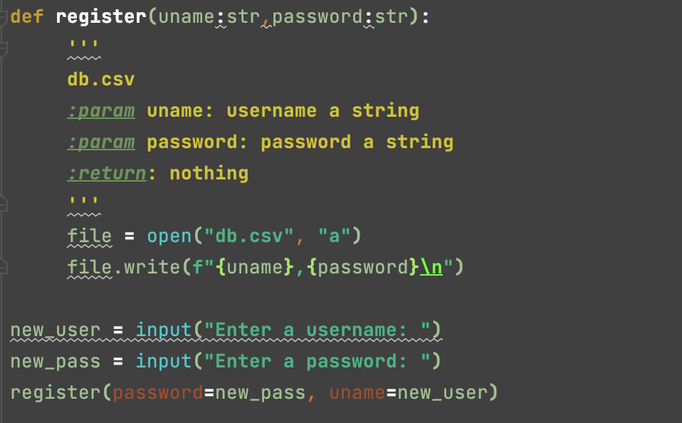
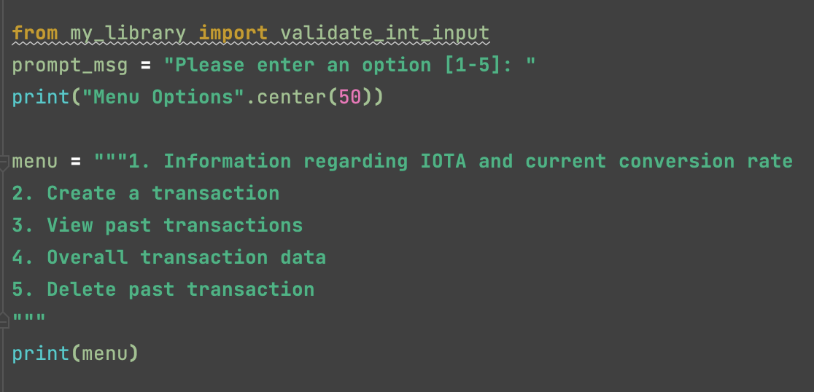
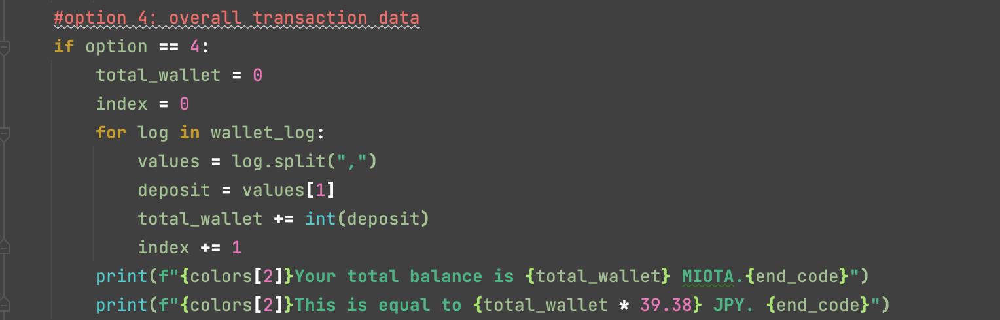

# Unit 1 Project: Crypto Wallet

  
Illustration: 

# Criteria A: Planning

## Problem Definition

Ms. Sato is a local trader who is interested in the emerging market of cryptocurrencies. She has started to buy and sell electronic currencies, however at the moment she is tracking all his transaction using a ledger in a spreadsheet which is starting to become burdensome and too disorganized. It is also difficult for Ms Sato to find past transactions or important statistics about the currency. Ms Sato is in need of a digital ledger that helps her track the amount of the cryptocurrency, the transactions, along with useful statistics.

Apart for this requirements, Ms Sato is open to explore a cryptocurrency selected by the developer.

## Proposed Solution

Design statement: I will to design and make a digital ledger for a client who is a local trader. The digital ledger will provide cryptocurrency tracking, which includes tracking of transactions and statistics regarding the selected cryptocurrency, IOTA, and is constructed using the software PyCharm. It will take two weeks to make and will be evaluated according to six success criterias. 

IOTA is a cryptocurrency that strives to eradicate the limitations that blockchains have on the world of crypto. Blockchains are a way that data about crypto transactions can be stored, but has a multitude of downfalls, like it's lack of privacy and potential costliness. In order to combat this issue, IOTA operates on a network called the Internet of Things which claims to allow for feeless and safe transactions. 

Citation:

Cambridge Dictionary. “Blockchain.” @CambridgeWords, 21 Sept. 2022, dictionary.cambridge.org/ja/dictionary/english/blockchain. Accessed 23 Sept. 2022.

Houston, Rickie. “Blockchain 101: Definition, Explanation, Pros & Cons.” Business Insider, Insider, 13 July 2022, www.businessinsider.com/personal-finance/what-is-blockchain. Accessed 23 Sept. 2022.
‌
“What Is IOTA.” Iota.org, 2022, www.iota.org/get-started/what-is-iota. Accessed 23 Sept. 2022.

Justify the tools/structure of your solution

## Success Criterias 

1. The electronic ledger is a text-based software that runs in the PyCharm terminal
2. The electronic ledger display the basic description of the cryptocurrency selected
3. The electronic ledger allows to enter, withdraw and record transactions. 
4. The electronic ledger is password protected so that only the client can access it. 
5. The electronic ledger shows past transaction history.
6. The electronic ledger shows the total amount in the clients wallet and converts to JPY.

# Criteria B: Design

## System Diagram

## Flow Diagrams

Fig. 1: This flow diagram is for showing all past transactions to the user.

Fig. 2: This flow diagram is so the user can input two types of transactions into their digital ledger. This includes both withdrawals and deposits. The withdrawals will automatically be added to the wallet as a negative number in order to indicate the loss of money.

Fig. 3: This flow diagram is so the user can see the total money that is currently in the wallet after adding/subtracting all past transactions. This also converts the total MIOTA that Ms. Sato is in possession of to JPY (yen).

## Test Plan

| Software Test Type | Description | Category | Planned Outcome  |
|------|-------------|----------|---------|
| Sep 23 2022 | bought a house | Expenses | 10 BTC |
| Sep 24 2022 | food for house celebration | Food | 0.000001 BTC |

## Record of Tasks
| Task No | Planned Action                                                | Planned Outcome                                                                                                 | Time estimate | Target completion date | Criterion |
|---------|---------------------------------------------------------------|-----------------------------------------------------------------------------------------------------------------|---------------|------------------------|-----------|
| 1       | Problem definition and client needs                                        | To have a clear understanding of what Ms. Sato requires and define them in order to proceed to meeting her needs.                        | 10 mins         | Sep 23                 | A         |
| 2       | Design Statement and success criteria                                         | Clear design statement on what will be included in the digital ledger and success criteria outlining solutions to the client's problem.                         | 10 mins         | Sep 23                 | A         |
| 3       | Create system diagram                                         | To have a clear idea of the hardware and software requirements for the proposed solution.                        | 30 mins         | Sep 23                 | B         |
| 4       | Create registration                                         | Allows user to create personal username and password.                        | 30 mins         | Sep 24                 | C         |
| 5       | Create login system                                         | A login system than only allows access if the password and username are correct.                        | 30 mins         | Sep 24                 | C         |
| 6       | Menu                                         | A menu that clearly shows the options the user has when using the digital ledger.                         | 10 mins         | Sep 24                 | C         |
| 7       | Menu Option #1: Information about IOTA (MIOTA)                                         | Description of cryptocurrency for the user so the user has background information on the type of currency that they are investing in.                          | 10 mins         | Sep 24                 | C         |
| 8       | Option #2: Creating transactions                                         | User is able to input both withdrawals and transactions into digital ledger. If there is a mistake, user can use another option to delete past transactions (option #5).                          | 60 mins         | Sep 25                 | C         |
| 9       | Option #3: View past transactions                                         | Allows user to view all past transactions in a chart.                         | 30 mins         | Sep 25                 | C         |
| 10       | Option #4: Overall transaction data                                         | Allows user to see total amount of money in wallet and also converts to JPY.                         | 30 mins         | Sep 26                 | C         |
| 11       | Draw flow diagrams and provide an explanation of their purpose                                         | Clear diagram showing aspects of code and description of purpose of the code.                         | 120 mins         | Oct 6                 | C         |
# Criteria C: Development

## 01. Registration

## 02. Login and Welcome Message

## 03. Menu

## 04. Validate user input to menu

## 05. IOTA Background Information and Conversion Rate (Menu Option #1)

## 06: User transactions (Menu Option #2)

## 07: Transaction History (Menu Option #3)

## 08: Overall balance and Conversion (Menu Option #4)

## 09: Restart to menu 

