# Unit 1 Project: Crypto Wallet

  
Illustration: 

# Criteria A: Planning

## Problem Definition

Ms. Sato is a local trader who is interested in the emerging market of cryptocurrencies. She has started to buy and sell electronic currencies, however at the moment she is tracking all his transaction using a ledger in a spreadsheet which is starting to become burdensome and too disorganized. It is also difficult for Ms Sato to find past transactions or important statistics about the currency. Ms Sato is in need of a digital ledger that helps her track the amount of the cryptocurrency, the transactions, along with useful statistics.

Apart for this requirements, Ms Sato is open to explore a cryptocurrency selected by the developer.

## Proposed Solution

Design statement: I will to design and make a digital ledger for a client who is a local trader. The digital ledger will provide cryptocurrency tracking, which includes tracking of transactions and statistics regarding the selected cryptocurrency, IOTA, and is constructed using the software PyCharm. It will take two weeks to make and will be evaluated according to six success criterias. 

IOTA is a cryptocurrency that strives to eradicate the limitations that blockchains have on the world of crypto. Blockchains are a way that data about crypto transactions can be stored, but has a multitude of downfalls, like it's lack of privacy and potential costliness. In order to combat this issue, IOTA operates on a network called the Internet of Things which claims to allow for feeless and safe transactions. 

## Rationale for Proposed Solution

As stated in the design statement, the coding language Python through software PyCharm will be utilized in order to create the digital ledger for the client. Python will be utilized for this task as Python code can be executed faster than other coding languages, which will be beneficial for both the designer of the code and the client. Python is also not susceptible to degrading or loss in performance and also has easy to use syntax and is extremely user-friendly (Dinh). PyCharm is used in conjunction with Python as it has many features that will heighten the performance of the code in order to deliver the highest functioning product to the client. One of these is integrated debugging, which allows for the developer to solve issues with code faster, making the platform highly efficient. PyCharm is also an IDE (Integrated Development Environment) which means it comes with many features that are suitable for software developmebnt(Simran). These factors make the two aperfect combination when developing software for a client.

IOTA was chosen as the cryptocurrency for Ms. Sato as IOTA works to eradicate the downfalls that come with blockchains. This will mean that the client can trade cryptocurrency with a heightened sense of security, as IOTA's operating network reduces the lack of privacy that comes with the usage of blockchains to store crypto information. 

Citation:

Cambridge Dictionary. “Blockchain.” @CambridgeWords, 21 Sept. 2022, dictionary.cambridge.org/ja/dictionary/english/blockchain. Accessed 23 Sept. 2022.

Đình Doanh (Donny. “Python Is One of the Languages That Is Witnessing Incredible Growth and Popularity Year by Year. In 2017, S...” Linkedin.com, 22 Nov. 2021, www.linkedin.com/pulse/top-10-reasons-why-python-so-popular-developers-2021-doanh-donny-. Accessed 9 Oct. 2022.

Houston, Rickie. “Blockchain 101: Definition, Explanation, Pros & Cons.” Business Insider, Insider, 13 July 2022, www.businessinsider.com/personal-finance/what-is-blockchain. Accessed 23 Sept. 2022.

Simran Kaur Arora. “What Is PyCharm? Features, Advantages & Disadvantages.” Hackr.io, 2022, hackr.io/blog/what-is-pycharm#:~:text=PyCharm%20is%20an%20extremely%20popular,that%20facilitate%20comprehensive%20software%20development.. Accessed 9 Oct. 2022.
‌
“What Is IOTA.” Iota.org, 2022, www.iota.org/get-started/what-is-iota. Accessed 23 Sept. 2022.

Justify the tools/structure of your solution

## Success Criterias 

1. The electronic ledger is a text-based software that runs in the PyCharm terminal
2. The electronic ledger display the basic description of the cryptocurrency selected
3. The electronic ledger allows to enter, withdraw and record transactions. 
4. The electronic ledger is password protected so that only the client can access it. 
5. The electronic ledger shows past transaction history.
6. The electronic ledger shows the total amount in the clients wallet and converts to JPY.

# Criteria B: Design

## System Diagram

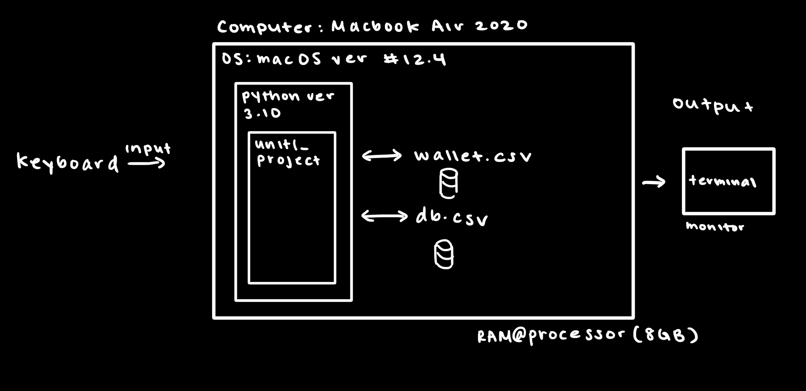

## Flow Diagrams

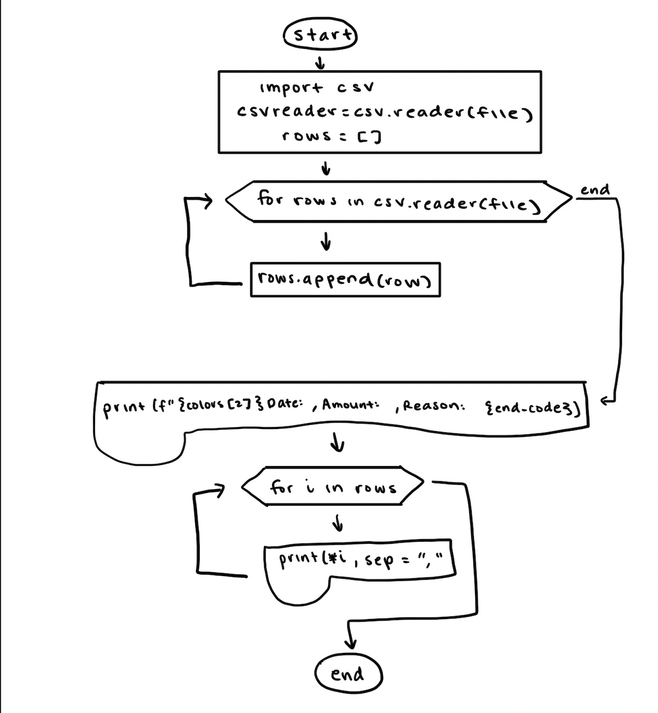
Fig. 1: This flow diagram is for showing all past transactions to the user.
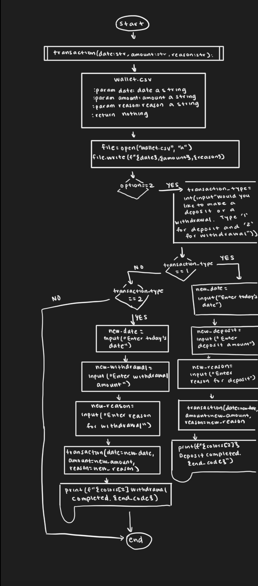
Fig. 2: This flow diagram is so the user can input two types of transactions into their digital ledger. This includes both withdrawals and deposits. The withdrawals will automatically be added to the wallet as a negative number in order to indicate the loss of money.
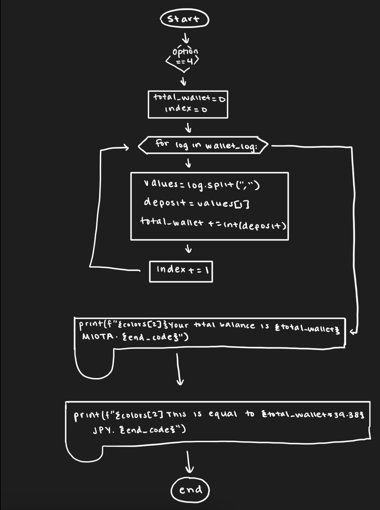
Fig. 3: This flow diagram is so the user can see the total money that is currently in the wallet after adding/subtracting all past transactions. This also converts the total MIOTA that Ms. Sato is in possession of to JPY (yen).

## Test Plan

| Software Test Type | Input | Process | Planned Output  |
|------|-------------|----------|---------|
| Unit Testing | Login function (def login) | 1. Call function. 2. Input correct or incorrect username and/or password. | Access granted if username and password is correct, otherwise, acess denied. |
| Unit testing | validate_int_input | 1. Import validate_int_input from library. 2. Enter a letter and/or numbers when prompted to pick a value between 1 and 4. | Code will proceed to the correct menu option if an integer value between 1 and 4 is inputed. Error message and another prompt will appear if value is not an integer and/or not between 1 and 4. |
| Integrational Testing | Register and Login function | 1. Set up a username and password by calling the register function. 2. Call login function 3. Input correct or incorrect username and/or password.| If user input when prompted to login matches with registered username and password, access will be granted. Otherwise, access will be denied and the code will exit. |
| Unit Testing | Restart function | 1. When the chosen menu option is fulfilled, user will be prompted to choose to continue browsing ledger or exit. 2. User will choose either to continue or to exit. | If user wants to continue, the menu options will be reprinted and the user will be allowed to choose another option or continue to browse the ledger features in general. If not, the user will be logged out. |
| Unit Testing | Main function | 1. User will have already picked an option and the option will have already been validated. 2. The user responds to prompts based off of the option that they chose. | The corresponding option to what the user chose when prompted will run. |
| System Testing | Entire code | 1. Registration will commence. 2. After registration the user will input username and password. 3. If correct, user will pick an option. 4. After option is completed, user responds to prompt of wanting to continue or not. | Entire code including all functions, csv files will work according to program. |

## Record of Tasks
| Task No | Planned Action                                                | Planned Outcome                                                                                                 | Time estimate | Target completion date | Criterion |
|---------|---------------------------------------------------------------|-----------------------------------------------------------------------------------------------------------------|---------------|------------------------|-----------|
| 1       | Problem definition and client needs                                        | To have a clear understanding of what Ms. Sato requires and define them in order to proceed to meeting her needs.                        | 10 mins         | Sep 23                 | A         |
| 2       | Design Statement and success criteria                                         | Clear design statement on what will be included in the digital ledger and success criteria outlining solutions to the client's problem.                         | 10 mins         | Sep 23                 | A         |
| 3       | Create system diagram                                         | To have a clear idea of the hardware and software requirements for the proposed solution.                        | 30 mins         | Sep 24                 | B         |
| 4       | Create registration                                         | Allows user to create personal username and password.                        | 30 mins         | Sep 24                 | C         |
| 5       | Create login system                                         | A login system than only allows access if the password and username are correct.                        | 30 mins         | Sep 24                 | C         |
| 6       | Menu                                         | A menu that clearly shows the options the user has when using the digital ledger.                         | 10 mins         | Sep 25                 | C         |
| 7       | Menu Option #1: Information about IOTA (MIOTA)                                         | Description of cryptocurrency for the user so the user has background information on the type of currency that they are investing in.                          | 10 mins         | Sep 24                 | C         |
| 8       | Option #2: Creating transactions                                         | User is able to input both withdrawals and transactions into digital ledger. Withdrawals will automatically be appended to the wallet.csv as a negative number. Deposits will remain positive.                          | 90 mins         | Sep 26                 | C         |
| 9       | Option #3: View past transactions                                         | Allows user to view all past transactions in an organized manner.                         | 30 mins         | Sep 29                 | C         |
| 10       | Option #4: Overall transaction data                                         | Allows user to see total amount of money in wallet and also converts to JPY.                         | 45 mins         | Sep 26                 | C         |
| 11       | Draw flow diagrams and provide an explanation of their purpose                                         | Clear diagram showing aspects of code and description of purpose of the code.                         | 180 mins         | Oct 6                 | C         |
| 12       | Code descriptions                                         | Clear descriptions on the purpose of each aspect of the code.                         | 180 mins         | Oct 7                 | C         |
# Criteria C: Development

## 01. Registration

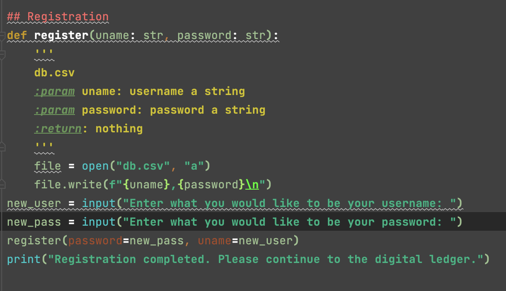

The registration allows Ms. Sato to create her own username and password to use whenever she is accessing the digital ledger. This allows the digital ledger to be unable to be accessed by any user other than the client. The registration is defined as function "register." Within the function, the append function is utilized so that the username and password of the clients choice can be appended to the chosen csv file, to save the information for future logins. The function can be called when Ms. Sato first accesses the ledger to create her account information. 

## 02. Login and Welcome Message

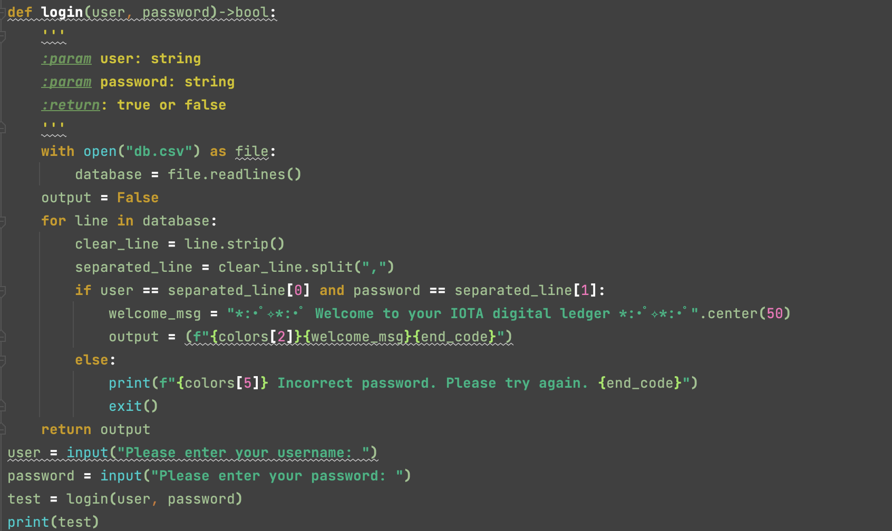

The code above depicts the login function. Db.csv is opened and read as it holds the saved user information that the client will have created for herself. A for loop is used in order to verify that the username and password inputed by the user matches the user information that has already been saved through registration. If the information is correct, a welcome message is printed. If the information is incorrect, the code will be exited.

## 03. Menu

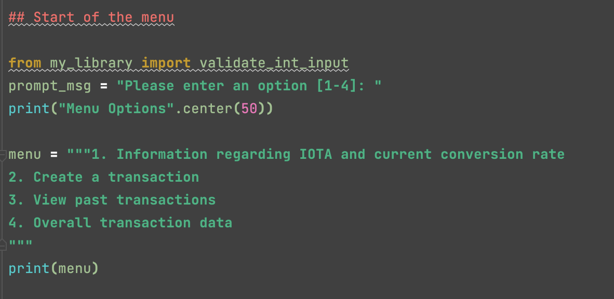

The main menu prints the options that the client has when using the digital ledger. 

## 04. Validate user input to menu

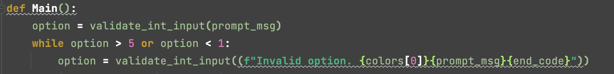

This code validates that the user inputs an integer value between 1 and 4, corresponding to the values present on the menu. If the user inputs a value outside of this range, the code will prompt the user to try again. 

## 05. IOTA Background Information and Conversion Rate (Menu Option #1)

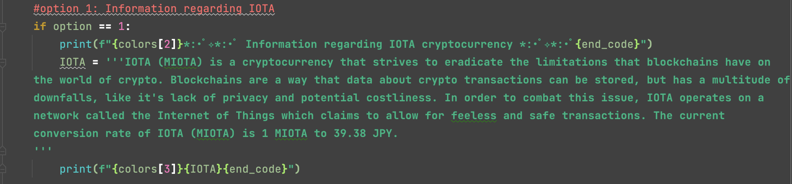

Provides background information on the selected cryptocurrencty IOTA (abbreviated MIOTA) in order to give client detailed information on what she is investing her money in. This also includes the current conversion rate to JPY for the client's convenience. 

## 06: User transactions (Menu Option #2)

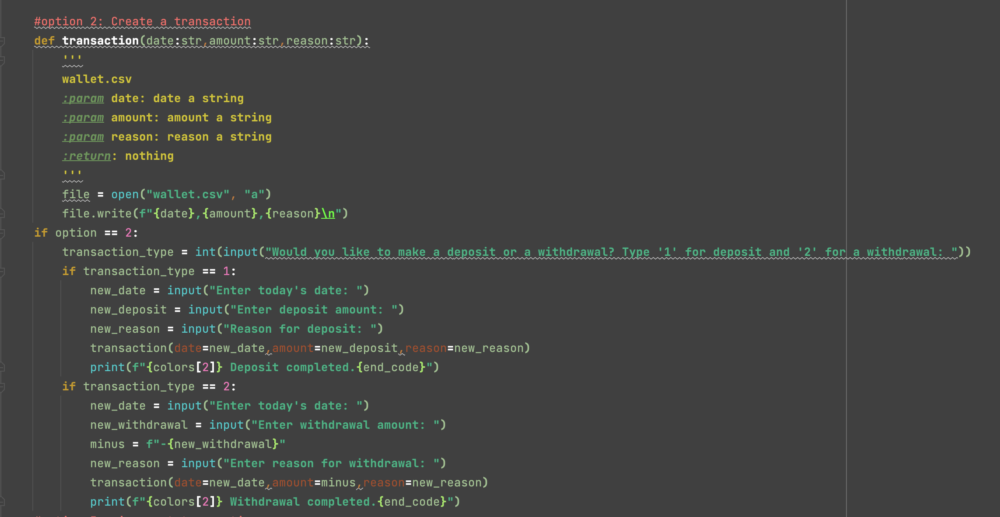

The code above allows the user to create two types of transactions, a deposit or a withdrawal. The user can do this by typing '1' or '2' when prompted by the code. '1' corresponds with a deposit and '2' corresponds with a withdrawal. The user will then be prompted to add the date, value, and reason for the deposit/withdrawal. This will help the client organize and remember her past transactions when using Menu Option #3, Transaction history. The clients inputs will then be added to a csv file (wallet.csv) by using the append function, so that the user can view these past rtansactions in the future. When a deposit or withdrawal is properly completed, a message will appear informing the user of a successful transaction, using the print function.

## 07: Transaction History (Menu Option #3)

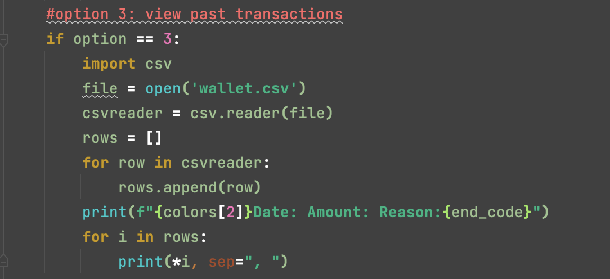

The code above allows the client to view all her past transactions. This is done by opening the wallet.csv, which stores all the past transactions that the user has inputed into the digital ledger, and reading and printing these past values, organized by date, amount, and reason for transaction. 

## 08: Overall balance and Conversion (Menu Option #4)

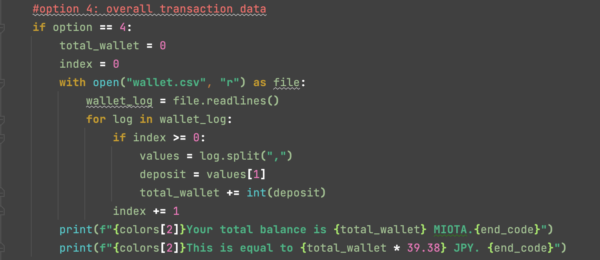

The code above allows the client to see their overall balance, an accumulation of all past deposits and withdrawals. This total value is then converted to JPY for the clients convenience, especially if she is considering withdrawing money.

## 09: Restart to menu 

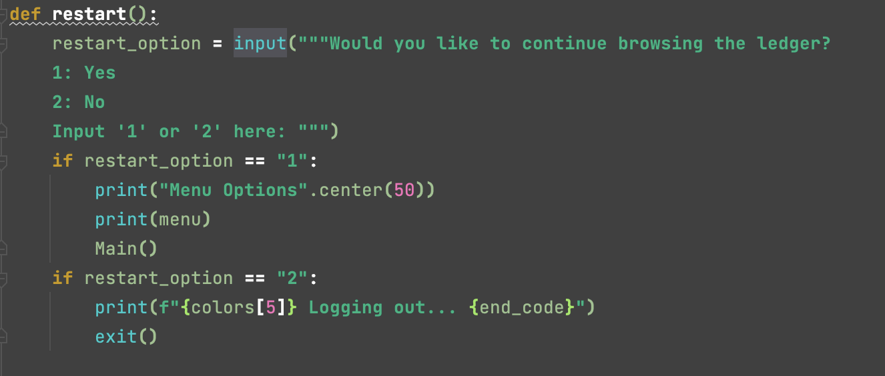
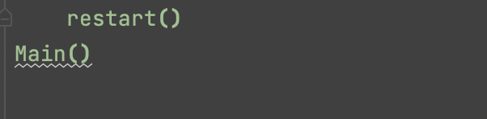

The restart function allows the client to be prompted to either choose another menu option or log out of the digital ledger when the previous option is completed. The restart function runs after every option until the client decides she wants to log out of her digital ledger. This allows the client to fluidly interact with the digital ledger without constantly logging back in or restarting the software. The restart function utilized a defined function and if statements in order to deliver a smooth experience to the client. 

## Video of program

