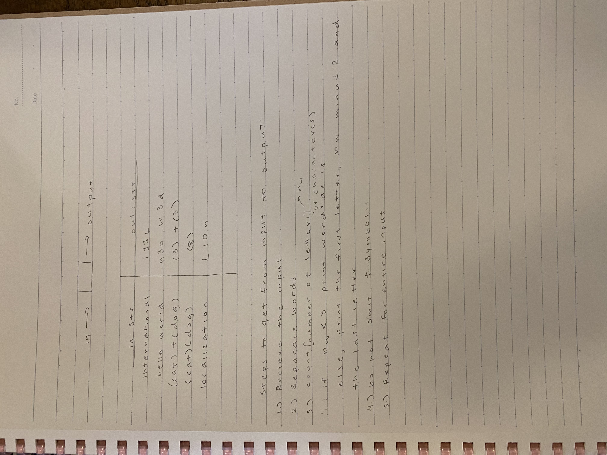
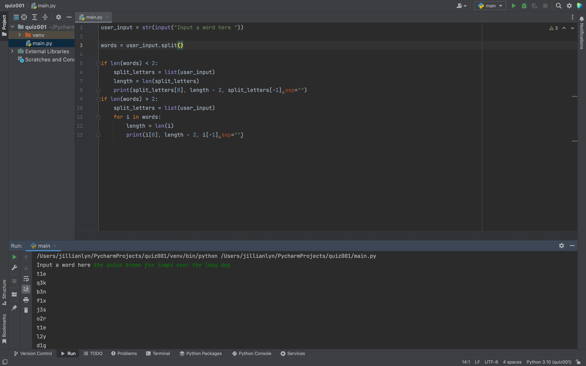

# Quiz 1

Fig.1 Solution to the quiz.
Fig.2 Code of the quiz.
Fig.3 Flow chart.

In Fig.1 I solved the quiz by figuring out that if the words in the input had more than 2 letters, that the output would print the first letter, the number of total letters in the word minus two, and the last letter. 

In Fig.2 I coded the quiz by separating each of the letters in the input and only printing the first and the last. Then, in between those letters, I printed the overall length of the word in the input - 2 (because the first letter and last letter are already printed). This cycle is repeated for each word in inputs with more than one word, as shown in the screenshot.

In Fig.3 I compiled each aspect of the code that I wrote in a flow chart, utilizing different shapes to represent different functions of my code.
