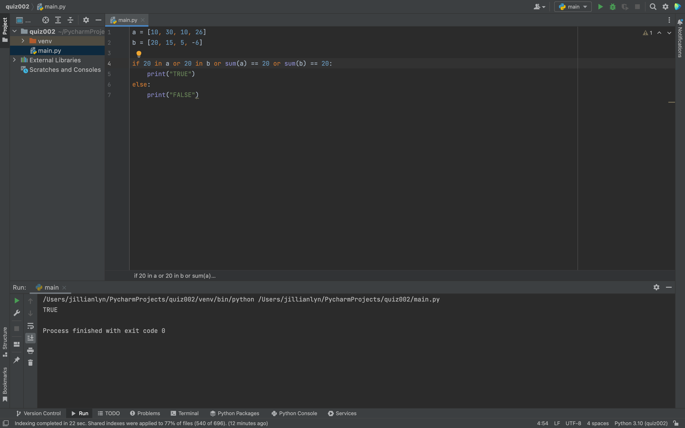
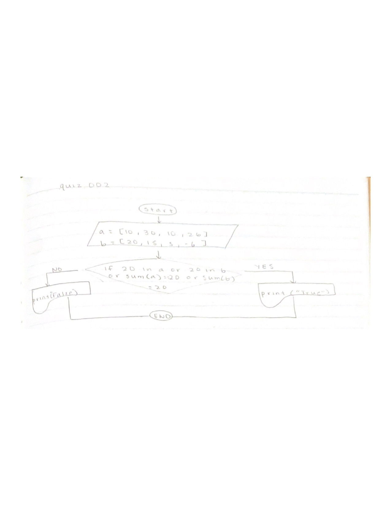

# Quiz 002

]

Fig.1 Solution to the quiz
Fig.2 Flow chart for the quiz

In Fig.1, I solved the quiz by figuring out that using an if/else statement can produce the correct output (true/false) based on the two provided lists.

In Fig.2, I utilized the different shapes of a python flow chart in order to organize my code into a chart that displays all the inputs, variables, outputs, etc. of my code. 
