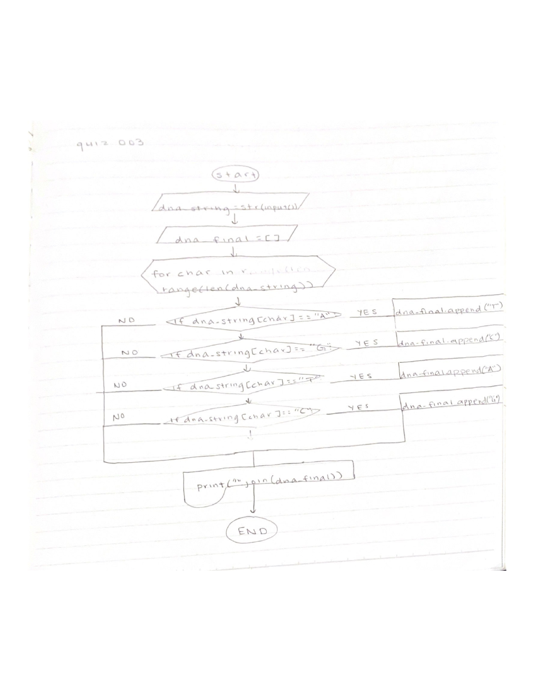

# Quiz 003

Fig.1 Solution to the quiz
Fig.2 Flow chart for quiz

In Fig.1 I solved the quiz by having the dna string inputs be appended to a list as the correct dna string output. I then printed the joined string to create the final dna string. 

In Fig.2 I used a multitude of if strings in my flow chart in order to demonstrate the conversion of the letters in a dna string. I also utilized the other shapes to display the input, output, etc. values.
