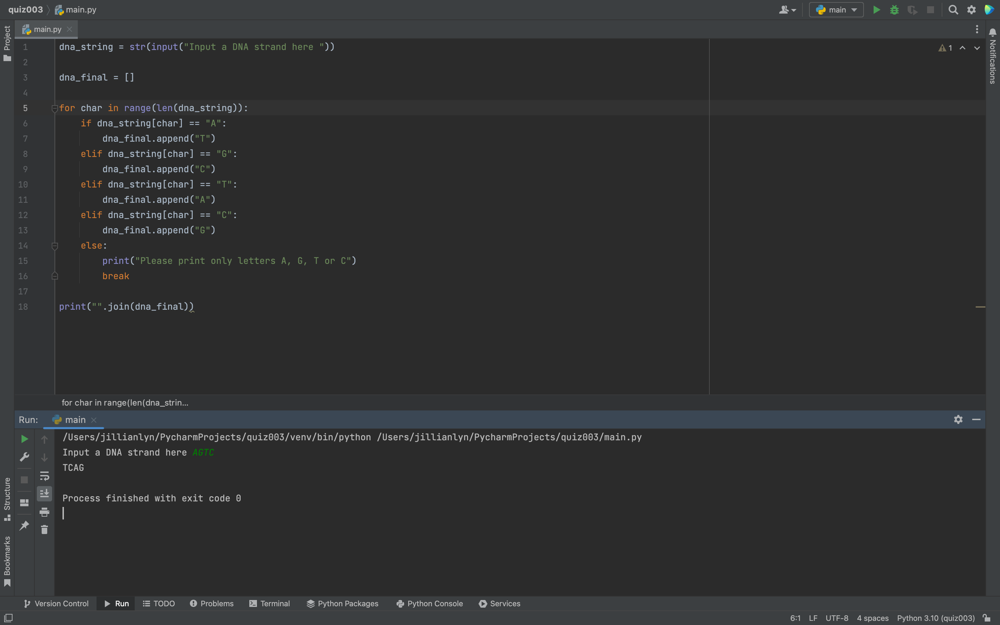

Fig.1 Solution to the quiz.

In Fig.1 I solved the quiz by having the dna string inputs be appended to a list as the correct dna string output. I then printed the joined string to create the final dna string. 
