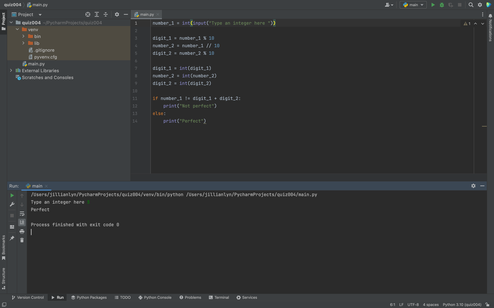

# Quiz 004

Fig.1 Flow chart for quiz
Fig.2 Solution to quiz

In Fig.1 I created a more efficient flow chart than the one initially provided by creating better variable names and taking out unnecessary lines of code.

In Fig.2 I coded the flow chart with the improved variable names that can output "Perfect" or "Not Perfect" depending on the integer that the user inputs. 
