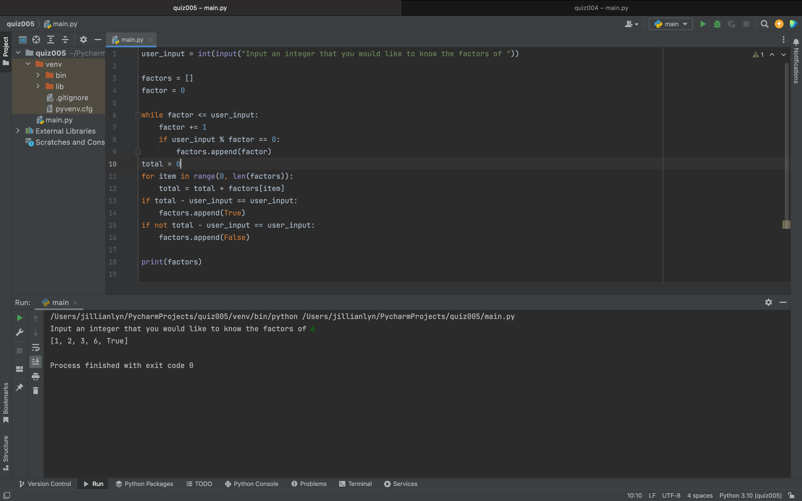
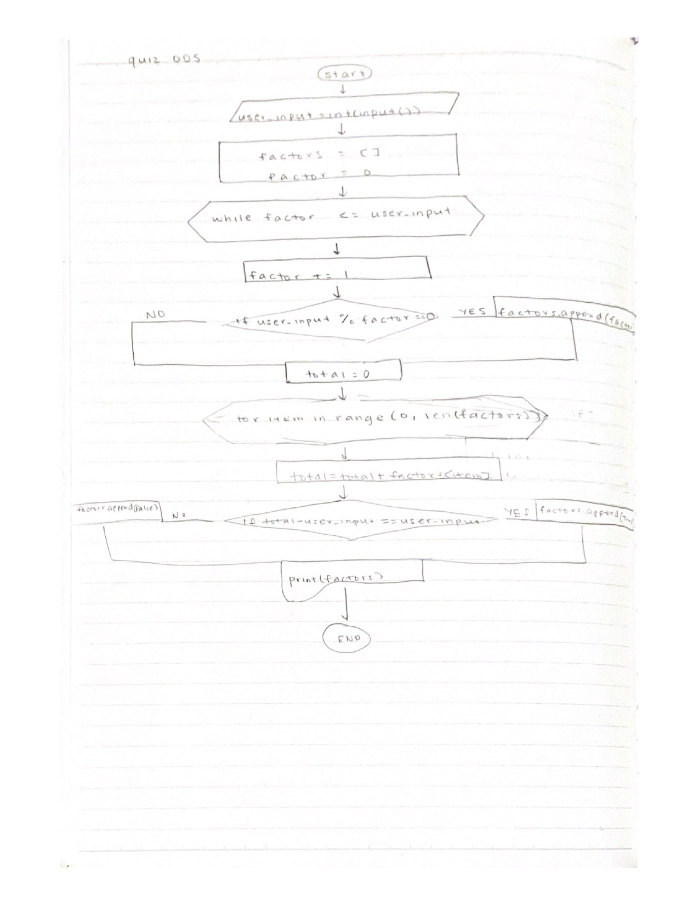

# Quiz 005

Fig.1 Code for solution to quiz
Fig.2 FLow chart for quiz

In Fig.1, I solved this quiz by first figuring out how to add different variables to a list. This allowed me to make a program that could print factors of the user input as a list. I then figured out how to use a for loop to add the items in a list without converting them to integers. This allowed me to determine whether the user input was a perfect number or not, in order to give the output "True" or "False."
