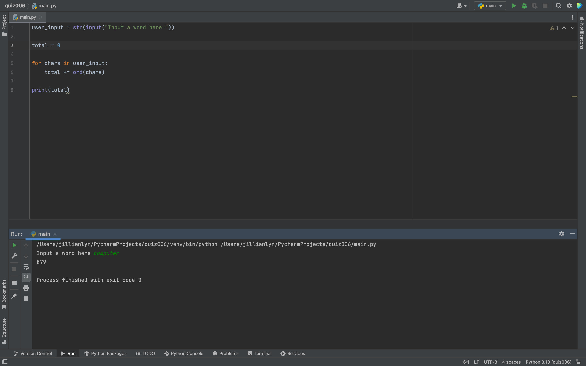

Fig.1 Solution to quiz.

I solved this quiz by utilizing the ord() command that was taught in the lesson on the day this quiz was given. I utilized hte ord() command in order to convert the letter into its assigned ascii number value and then used the a for loop to repeat the conversion for each letter and += in order to add consecutive letters together. Then I printed the final sum of the total of the ascii number values in the user input word, in this case "computer."
