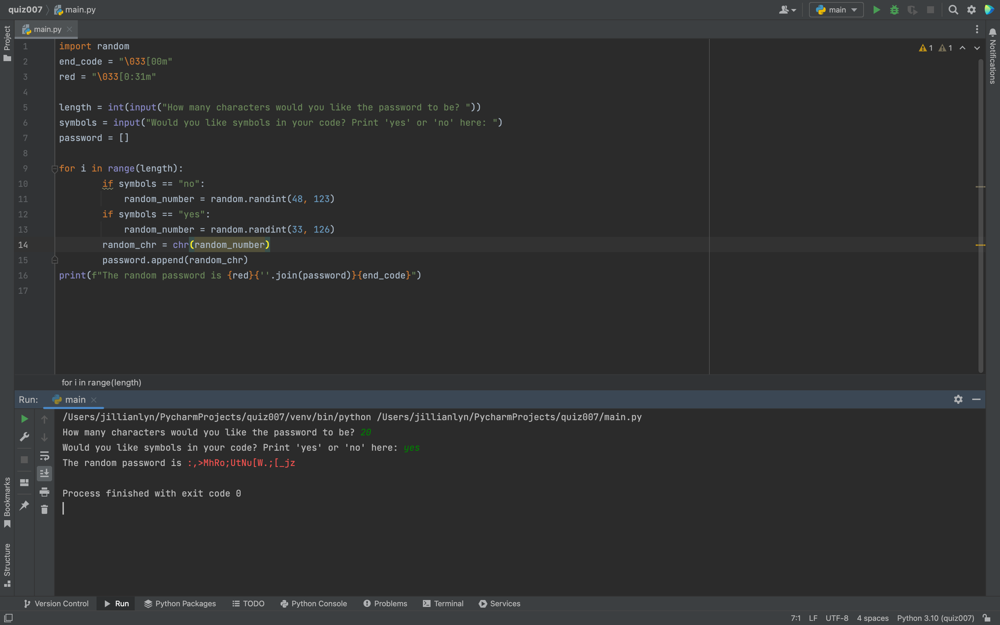

Fig.1 Solution to the quiz.

In Fig.1 I solved the quiz by utilizing if statements in order create a range in the ascii table for my random generated passcode. I used ANSI color codes in order to print the password in red.
