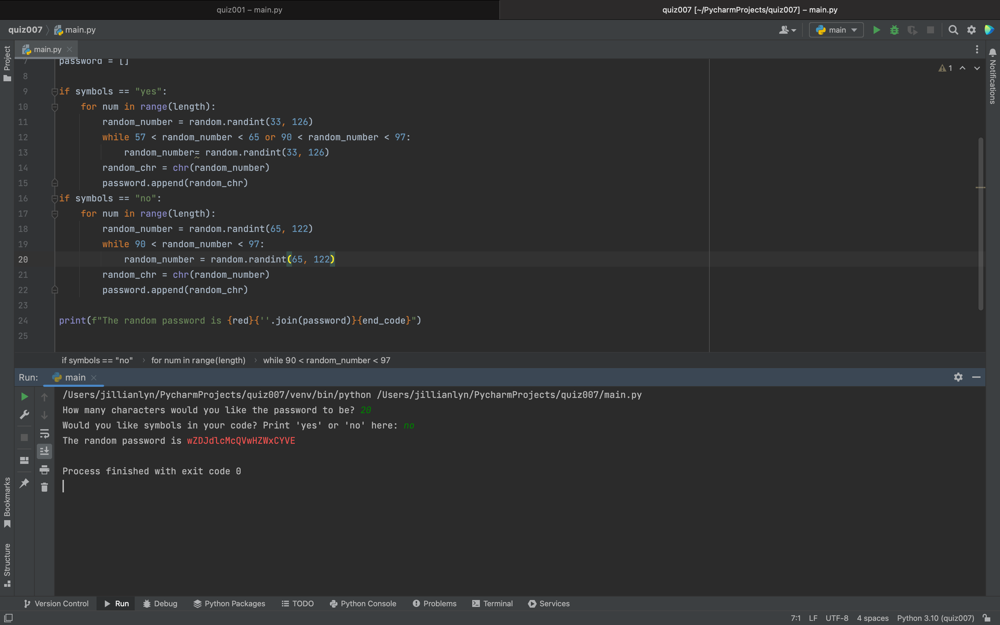

# Quiz 007

import random
end_code = "\033[00m"
red = "\033[0:31m"

length = int(input("How many characters would you like the password to be? "))
symbols = input("Would you like symbols in your code? Print 'yes' or 'no' here: ")
password = []

if symbols == "yes":
    for num in range(length):
        random_number = random.randint(33, 126)
        while 57 < random_number < 65 or 90 < random_number < 97:
            random_number= random.randint(33, 126)
        random_chr = chr(random_number)
        password.append(random_chr)
if symbols == "no":
    for num in range(length):
        random_number = random.randint(65, 122)
        while 90 < random_number < 97:
            random_number = random.randint(65, 122)
        random_chr = chr(random_number)
        password.append(random_chr)

print(f"The random password is {red}{''.join(password)}{end_code}")

Fig.1 Solution to the quiz.
Fig.2 Code

In Fig.1 I solved the quiz by utilizing if statements in order create a range in the ascii table for my random generated passcode. I used ANSI color codes in order to print the password in red.
