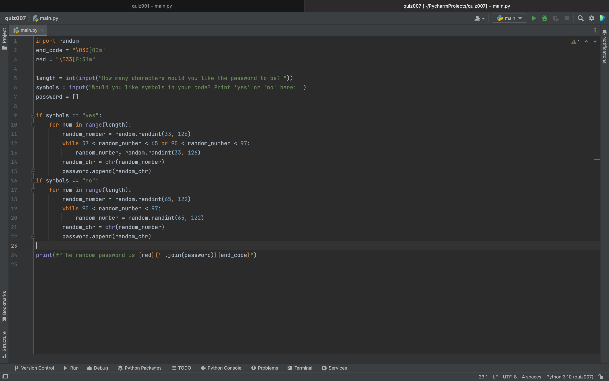

# Quiz 007

Fig.1 Coded solution to the quiz.

Fig.2 and Fig.3 Outputs showing that program works.

Fig.4 Flowchart 

In Fig.1 I solved the quiz by utilizing if statements in order create a range in the ascii table for my random generated passcode. I used ANSI color codes in order to print the password in red.
