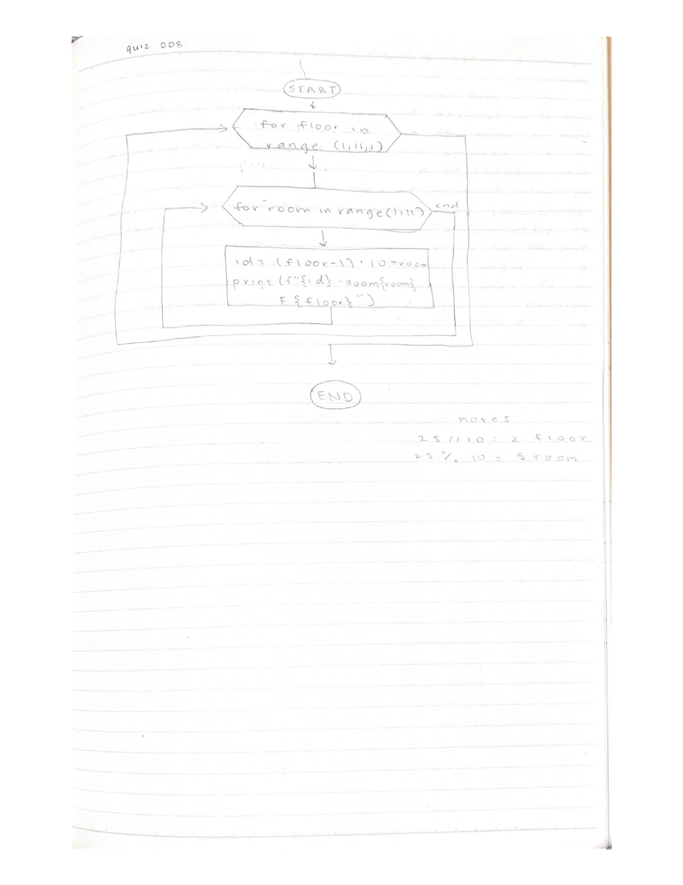
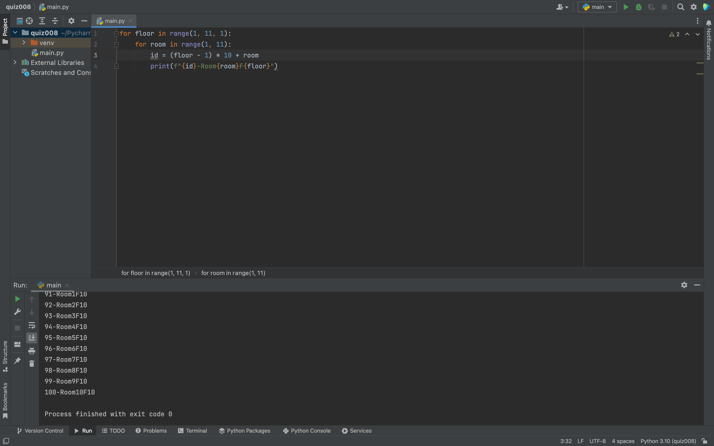

# Quiz 008

Fig.1 Flow chart for quiz 008

Fig.2 Flow chart converted to code

In Fig.1, I created a flow chart in order to calculate the room ID of all the rooms in a hotel with 100 rooms. Each floor has 10 rooms and there are 10 floors. For the variable "id", 1 is subtracted from floor to consider the fact that floors 0-10 are not floor 0 but rather floor 1. 
