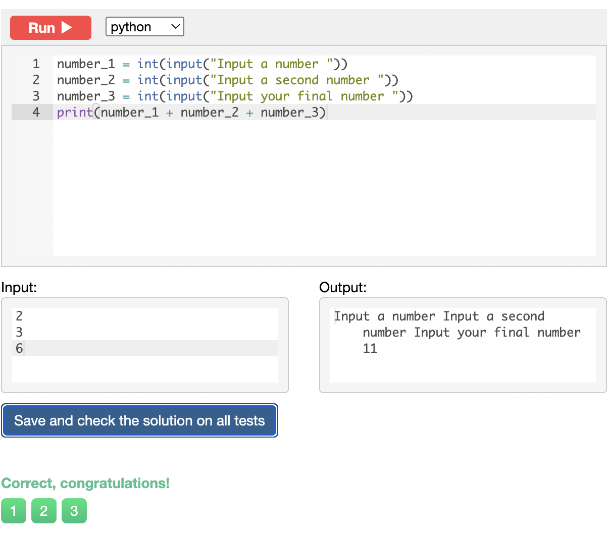
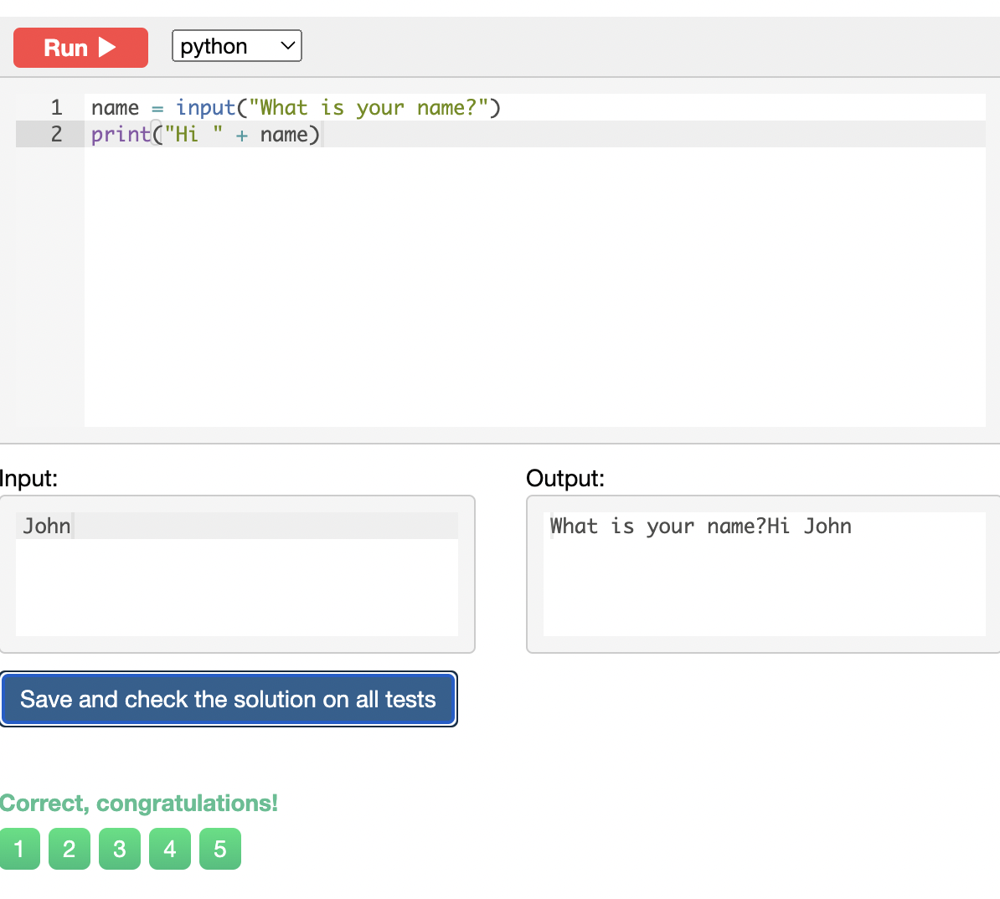
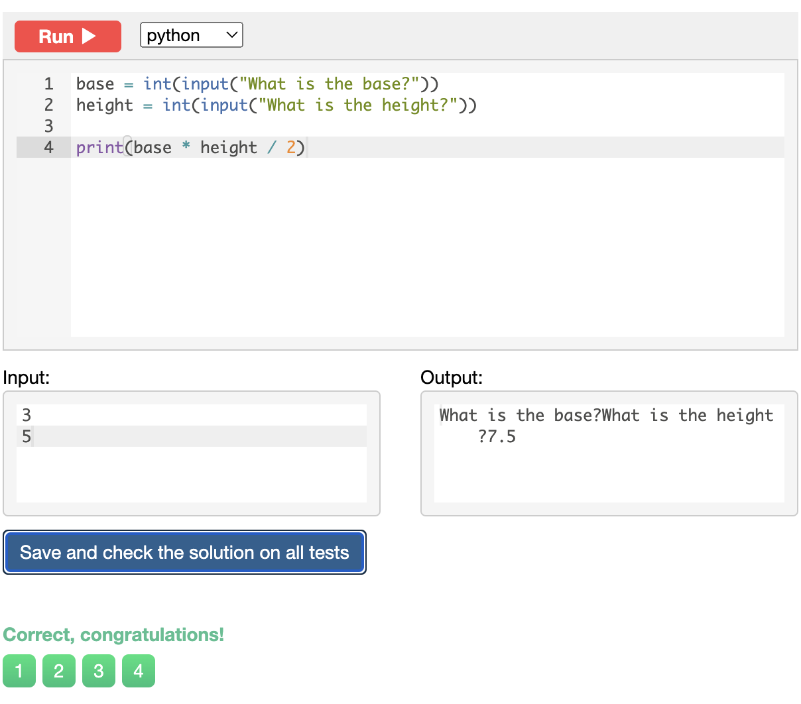
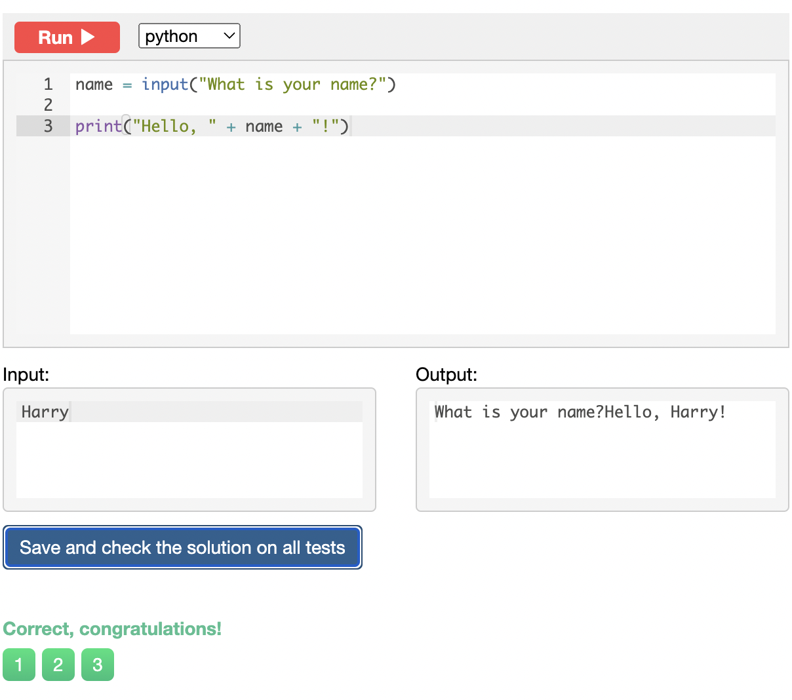
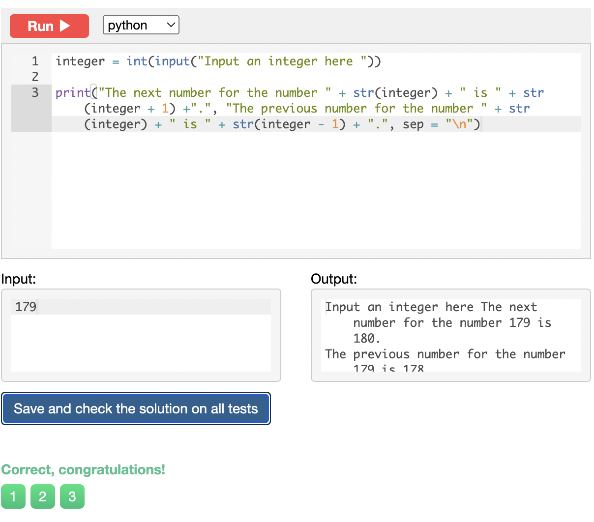
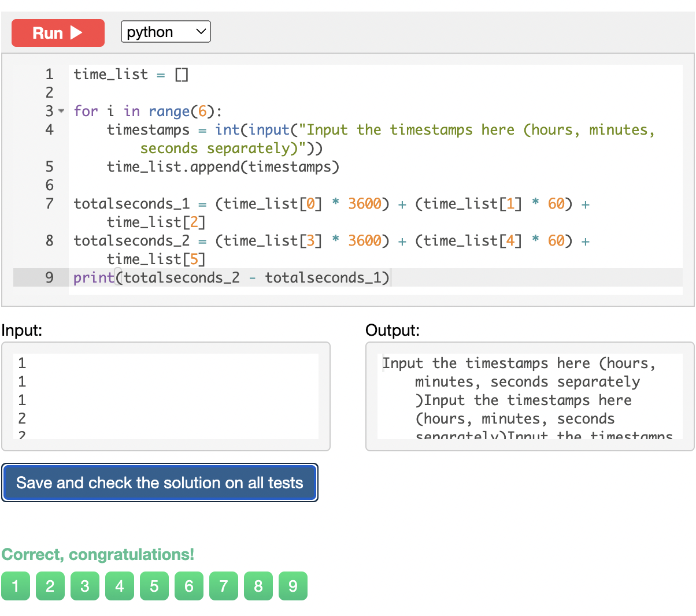

# Chapter 1 (Input, print and numbers)

## 01: Sum of three numbers

Write a program that takes three numbers and prints their sum. Every number is given on a separate line.

## 02: Hi John

Write a program that greets the person by printing the word "Hi" and the name of the person.

## 03: Square

Write a program that takes a number and print its square.

## 04: Area of right-angled triangle

Write a program that reads the length of the base and the height of a right-angled triangle and prints the area. Every number is given on a separate line.

## 05: Hello, Harry!

Write a program that greets the user by printing the word "Hello", a comma, the name of the user and an exclamation mark after it.

## 06: Apple Sharing

N students take K apples and distribute them among each other evenly. The remaining (the undivisible) part remains in the basket. How many apples will each single student get? How many apples will remain in the basket?

## 07: Previous and next

Write a program that reads an integer number and prints its previous and next numbers. See the examples below for the exact format your answers should take. There shouldn't be a space before the period.

## 08: Two timestamps

A timestamp is three numbers: a number of hours, minutes and seconds. Given two timestamps, calculate how many seconds is between them. The moment of the first timestamp occurred before the moment of the second timestamp.

## 09: School desks

A school decided to replace the desks in three classrooms. Each desk sits two students. Given the number of students in each class, print the smallest possible number of desks that can be purchased.

