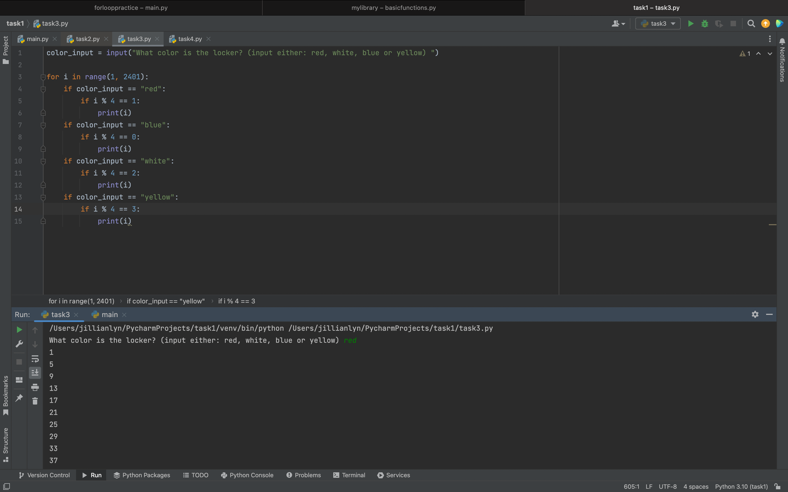
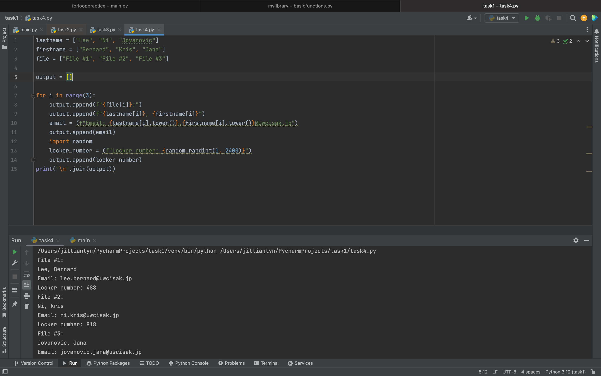

# Task #1: Programming Task (Computational Thinking)

Question #1: What is the most powerful computer? Glad you asked. Watch this video about Sierra Computer. Describe below points that surprised you the most.

The point that surprised me the most is how the purpose of Sierra changed after becoming a classified device. Instead of researching a broad range of topics that could be helpful to a wider demographic, the Sierra became confined to confidential research about degrading nuclear weaponry and arsenals (that theoretically should not even exist in the quantity that they do now) and the volatility of their potential detonations. I find it slightly disappointing that the most innovative and powerful computer is being utilized in order to test the potential outcomes of a nuclear weapon launch (which could save lives if it also researched how to safely solve the issue of aging of nuclear weaponry but it doesn’t seem to). 

Question #2: Supercomputers are currently used to investigate solutions to real life problems from cancer research, Ai, economics, or brain simulation. Military uses are also one major force behind the development of these machines. Analyze the benefits and possible drawbacks of developing supercomputers in our modern world? Should we do it?

The benefits of developing supercomputers in the modern world is that it can work through large problems and test many variations at a much higher rate than a human. This also has a negative flipside to it, as it can be used in order to research things or topics that can have a huge negative impact/effect at this same extremely high rate. I believe that the development of supercomputers at this point is relatively inevitable. The benefits and possible drawbacks lie in how supercomputers are utilized. If someone with bad intentions decided to utilize one, it will produce negative impacts at a faster rate. But on the other hand, with positive intentions, supercomputers can create life changing positive effects, like groundbreaking medical research. If the development is already inevitable, I believe that the development of supercomputers should move forward, but I believe that there should be a newfound larger emphasis on maintaining the morality of the usage of these technologies. 

Question #3: Identify the most advanced computer in your Country (What, specs, location, uses). 

The fastest supercomputers in my two countries are Frontier and Fugaku. Frontier is located in Tennessee and has 74 cabinets, a peak performance of 1.6 EF, a multitude of slingshot NICs that provide 100 GB/s network bandwidth and more. Frontier is dedicated to research in the medical field and works to uncover the genetics of diseases. Fugaku was developed by Fujitsu and is located in Kobe. Some of its specs are its 158,976 nodes, a total memory bandwidth of 4.85 PiB and memory bandwidth of 163PB/s. Fugaku has been utilized in the past to help with major global issues, with the most recent one being its contribution to helping during the COVID 19 pandemic.

Task #1

Task #2

Task #3

Task#4

Bibliography:

“Frontier.” Ornl.gov, 2022, www.olcf.ornl.gov/frontier/#4. Accessed 23 Sept. 2022.

“Supercomputer Fugaku.” Supercomputer Fugaku, 2020, www.fujitsu.com/global/about/innovation/fugaku/. Accessed 23 Sept. 2022.
